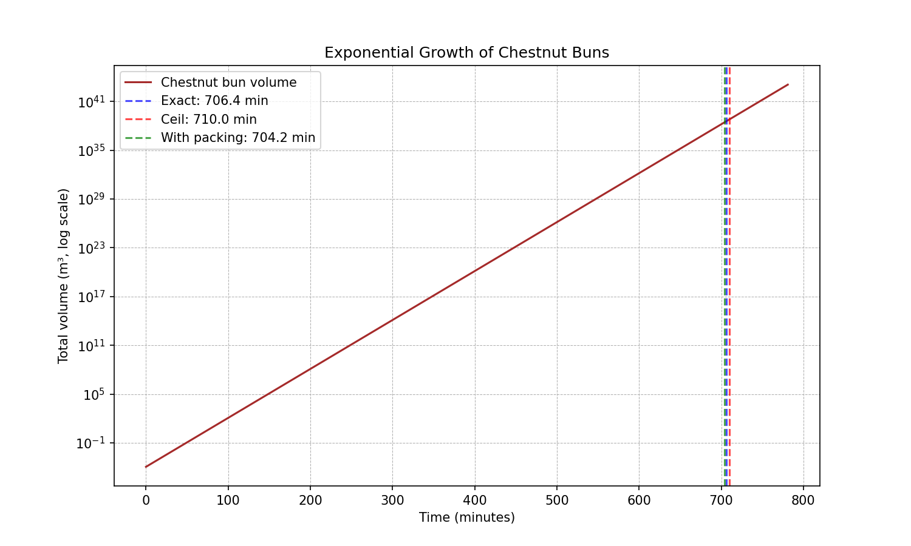

# Chestnut Bun Problem

## 📌 Purpose
This repository contains my solution to the **Chestnut Bun Problem**, inspired by growth problems like *Sorori Shinzaemon* and *Mt. Fuji*.  
It explores how **exponential doubling** can lead to astronomical scales.

---

## 🥮 Problem Statement
In Doraemon, a medicine called **Byvine** makes objects double every 5 minutes.  
If sprinkled on a chestnut bun, the number of buns doubles continuously.  

**Question**:  
*Starting with one chestnut bun, how long will it take until the buns fill the solar system?*

---

## 🔧 Assumptions
- Bun volume: `V0 ≈ 1.13 × 10^-4 m³`  
- Solar system volume: `Vsolar ≈ 3.81 × 10^38 m³`  
- Doubling period: `dt = 5 minutes`
---

## 🧮 Formula Derivation
At time `t`:

- `V(0) = V0`  
- `V(t) = V0 · 2^(t/dt)`  

We want time `T` such that:  
`Vsolar = V0 · 2^(T/dt)`  

Solving for `T`:  
`T = dt · log2(Vsolar / V0)`

---

## 📊 Approach
1. **Defined assumptions** (bun size, solar system volume).  
2. **Derived formula** for doubling growth.  
3. **Implemented Python scripts**:  
   - `chestnut.py` → calculates time and doublings  
   - `plot_growth.py` → plots exponential growth curve  
4. **Generated plots** saved in `figures/`.

---

## 📈 Results
- Required doublings (real): ~141.27  
- Time to reach target (real): ~11.77 hours (~0.49 days)  
- With integer ceiling: 142 doublings (~11.83 hours)  
- With packing correction: ~141.71 doublings (~11.81 hours)

---

## 📉 Growth Curve

The exponential growth of buns filling the solar system:




---

## 🚀 How to Run

```bash
# Clone the repository
git clone git@github.com:oktakarisa/chestnut-problem.git
cd chestnut-problem

# Run main script
python chestnut.py --ceil

# Generate plot
python plot_growth.py
```

Output plot will be saved under `figures/`.

---

## ✍️ Author
**Victor Karisa**  
Chestnut Problem Study – 2025

